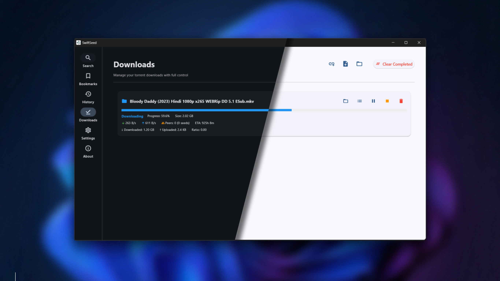

<div align="center">


# 🌱 SwiftSeed

### A Modern, Fast & Lightweight Torrent Search and Download Client

[](LICENSE)
[](https://www.python.org/downloads/)
[](https://github.com/sayandey021/SwiftSeed/releases)
[](https://github.com/sayandey021/SwiftSeed/releases/latest)

[Features](#-features) • [Installation](#-installation) • [Usage](#-usage) • [Building](#-building-from-source) • [Contributing](#-contributing)

</div>

---

## 📸 Screenshots

<div align="center">

### Search Interface


### Downloads Manager


</div>

---

## ✨ Features

- 🔍 **Unified Multi-Provider Search**
  - Search across multiple torrent providers simultaneously
  - Supported providers: ThePirateBay, Nyaa, 1337x, TorrentsCSV
  - Add custom Torznab-compatible providers

- 🚀 **Integrated Download Manager**
  - Built-in torrent downloader powered by libtorrent
  - No external clients required
  - Real-time download progress tracking
  - Pause/Resume/Stop downloads
  - Speed limiting and prioritization

- 🎨 **Modern & Beautiful UI**
  - Sleek dark-themed interface built with Flet
  - Responsive and intuitive design
  - Smooth animations and transitions
  - Category-based filtering

- 📂 **Smart Organization**
  - Filter by categories: Movies, TV Shows, Games, Anime, Music, Apps, and more
  - Sort results by seeders, size, or date
  - Select specific files from multi-file torrents

- ⭐ **Bookmarks & History**
  - Save favorite torrents for quick access
  - Automatic search history tracking
  - Easy management and cleanup

- ⚙️ **Highly Customizable**
  - Enable/disable individual providers
  - Customize download paths
  - Configure download limits and behavior
  - Dark/Light theme support
  - Advanced torrent settings

---

## 🚀 Installation

### Option 1: Download Pre-built Executable (Recommended for Windows Users)

1. Go to the [Releases](https://github.com/sayandey021/SwiftSeed/releases/latest) page
2. Download the latest version:
   - **Installer**: `SwiftSeed_Setup_v*.exe` - Installs to Program Files
   - **Portable**: `SwiftSeed_v*_Portable.zip` - No installation required
3. Run the installer or extract the portable version
4. Launch SwiftSeed and start searching!

### Option 2: Run from Source

#### Prerequisites
- Python 3.7 or higher
- pip (Python package manager)

#### Steps

1. **Clone the repository**
   ```bash
   git clone https://github.com/sayandey021/SwiftSeed.git
   cd SwiftSeed
   ```

2. **Install dependencies**
   ```bash
   pip install -r requirements.txt
   ```

3. **Run the application**
   ```bash
   python src/main.py
   ```

---

## 📖 Usage

### Basic Workflow

1. **Search for Torrents**
   - Enter your search query in the search bar
   - Select a category (optional)
   - Click the search button or press Enter
   - Results will appear from all enabled providers

2. **Download Torrents**
   - Click the "Download" button on any search result
   - Choose specific files to download (for multi-file torrents)
   - Select download location
   - Monitor progress in the "Downloads" tab

3. **Manage Downloads**
   - View all active and completed downloads
   - Pause, resume, or stop downloads
   - Open download folder
   - View detailed torrent information

4. **Customize Settings**
   - Navigate to the "Settings" tab
   - Configure download paths
   - Enable/disable providers
   - Add custom Torznab providers
   - Adjust download limits and behavior

### Advanced Features

- **Bookmarks**: Click the bookmark icon to save torrents for later
- **History**: Access your search history from the History tab
- **File Selection**: Choose specific files from multi-file torrents before downloading
- **Custom Providers**: Add your own Torznab-compatible indexers

---

## 🔨 Building from Source

Want to build your own executable? Follow the **[BUILD_GUIDE.md](BUILD_GUIDE.md)** for detailed instructions.

### Quick Build

```bash
# Build standalone executable
python build_exe.py

# Build installer (requires Inno Setup)
create_installer.bat

# Build portable ZIP
python create_portable_zip.py

# Build everything at once
python build_all.py
```

The built files will be in the `dist/` and `installer/` directories.

---

## 🗂️ Data Storage

SwiftSeed stores all user data in a dedicated directory:

- **Windows**: `C:\Users\<YourUsername>\.swiftseed\`
  - `settings.json` - Application settings
  - `bookmarks.json` - Saved bookmarks
  - `history.json` - Search history
  - `downloads.json` - Download state
  - `custom_providers.json` - Custom Torznab providers

---

## 🛠️ Tech Stack

- **UI Framework**: [Flet](https://flet.dev/) - Material Design UI for Python
- **Torrent Engine**: [libtorrent](https://www.libtorrent.org/) - High-performance BitTorrent library
- **HTTP Client**: [httpx](https://www.python-httpx.org/) - Modern async HTTP client
- **HTML Parsing**: [BeautifulSoup4](https://www.crummy.com/software/BeautifulSoup/) - Web scraping
- **Packaging**: [PyInstaller](https://pyinstaller.org/) - Executable bundling

---

## 🤝 Contributing

Contributions are welcome! Here's how you can help:

1. **Report Bugs**: Open an issue describing the problem
2. **Suggest Features**: Share your ideas for improvements
3. **Submit Pull Requests**: 
   - Fork the repository
   - Create a feature branch (`git checkout -b feature/AmazingFeature`)
   - Commit your changes (`git commit -m 'Add some AmazingFeature'`)
   - Push to the branch (`git push origin feature/AmazingFeature`)
   - Open a Pull Request

### Development Setup

```bash
# Clone your fork
git clone https://github.com/YOUR_USERNAME/SwiftSeed.git
cd SwiftSeed

# Create virtual environment
python -m venv venv
venv\Scripts\activate  # On Windows
# source venv/bin/activate  # On Linux/Mac

# Install dependencies
pip install -r requirements.txt

# Run in development mode
python src/main.py
```

---

## ⚠️ Disclaimer

SwiftSeed is a **search engine and download client** that aggregates publicly available torrent metadata from various sources. 

**Important Notes:**
- This application does **NOT** host any content
- The developer is **NOT** responsible for the content accessed or downloaded using this application
- Users are responsible for ensuring compliance with their local laws and regulations
- Respect copyright laws and only download content you have the right to access

**Use responsibly and legally.**

---

## 📄 License

This project is licensed under the MIT License - see the [LICENSE](LICENSE) file for details.

---

## 🙏 Acknowledgments

- Built with [Flet](https://flet.dev/) framework
- Powered by [libtorrent](https://www.libtorrent.org/)
- Icons from [Material Design Icons](https://materialdesignicons.com/)
- Inspired by the open-source community

---

## 📞 Support

- **Issues**: [GitHub Issues](https://github.com/sayandey021/SwiftSeed/issues)
- **Discussions**: [GitHub Discussions](https://github.com/sayandey021/SwiftSeed/discussions)

---

<div align="center">

**Made with ❤️ by [Sayan Dey](https://github.com/sayandey021)**

If you find this project useful, please consider giving it a ⭐!

</div>
